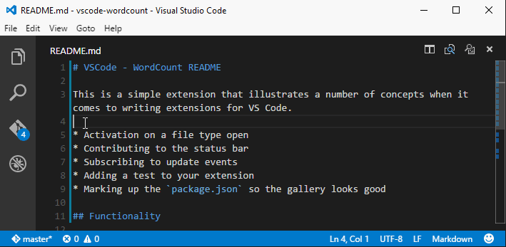

# VSCode - WordCount README
 
This is a simple extension that illustrates a number of concepts when it comes to writing extensions for VS Code.  

* Activation on a file type open
* Contributing to the status bar
* Subscribing to update events
* Adding a test to your extension
* Marking up the `package.json` so the gallery looks good

## Functionality

It's pretty simple open up a `Markdown` file and the status bar will have an auto-updating wordcount in it. It also...

* Counts number of words highlighted
* Offers other counting data such as characters (excluding spaces), sentences (basic full stop counting) and paragraphs

